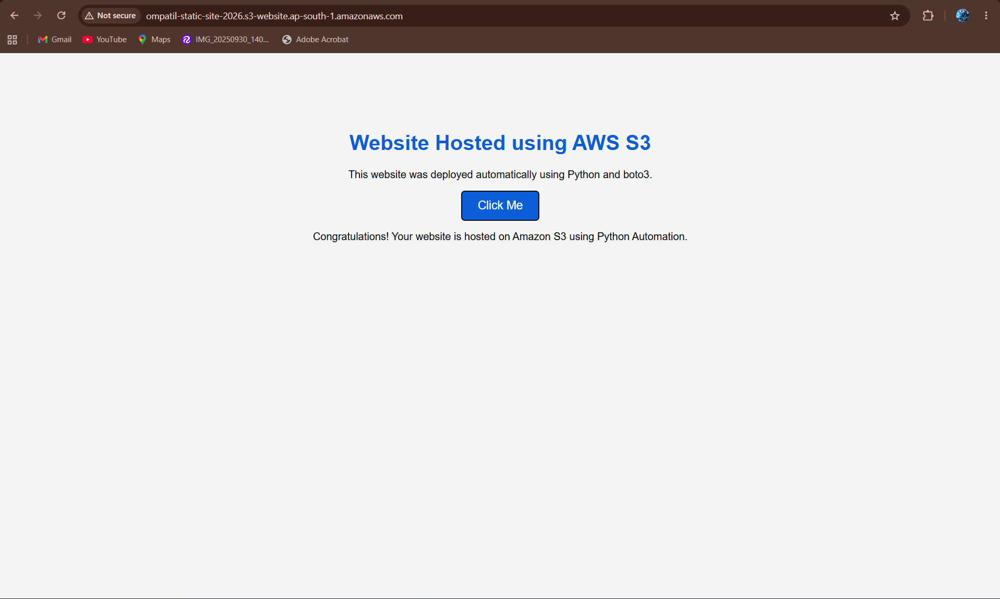

# 🚀 AWS Static Website Automation using Python (boto3)

A Python automation project that deploys a static website to **Amazon S3** using the **AWS SDK (boto3)**. This project eliminates the need to manually create buckets, upload website files, and configure static website hosting.

---

## 📖 Project Description

This project demonstrates how to automate the deployment of a static website on Amazon S3 using Python. The scripts create an S3 bucket, upload website files, enable static website hosting, and configure the bucket for public access.

The website consists of HTML, CSS, and JavaScript files and is hosted directly from Amazon S3.

---

## 🎯 Objectives

- Automate Amazon S3 bucket creation.
- Upload static website files automatically.
- Enable Static Website Hosting.
- Configure public access for the bucket.
- Deploy a website without manual AWS Console operations.

---

# 🛠️ AWS Services Used

- Amazon S3
- AWS IAM
- AWS SDK for Python (boto3)

---

# 💻 Technologies Used

- Python 3.x
- boto3
- HTML
- CSS
- JavaScript

---

# 📂 Project Structure

```
StaticWebsiteAutomation/
│
├── screenshots/
│   └── homepage.png
│
├── website/
│   ├── index.html
│   ├── style.css
│   └── script.js
│
├── deploy.py
├── upload.py
├── enable_hosting.py
├── public_access.py
├── requirements.txt
└── README.md
```

---

# ⚙️ Project Workflow

```
Start
   │
   ▼
Run deploy.py
   │
   ▼
Create Amazon S3 Bucket
   │
   ▼
Upload Website Files
   │
   ▼
Run enable_hosting.py
   │
   ▼
Enable Static Website Hosting
   │
   ▼
Run public_access.py
   │
   ▼
Configure Public Access
   │
   ▼
Website Hosted Successfully
```

---

# 🏗️ Architecture

```
                 Python Scripts
                      │
                 boto3 SDK
                      │
                      ▼
               Amazon S3 Bucket
        ┌─────────────────────────┐
        │ Create Bucket           │
        │ Upload Website Files    │
        │ Enable Website Hosting  │
        │ Configure Public Access │
        └─────────────────────────┘
                      │
                      ▼
          S3 Static Website Endpoint
                      │
                      ▼
              User's Web Browser
```

---

# ✨ Features

- ✅ Automated Amazon S3 bucket creation
- ✅ Automatic upload of website files
- ✅ Static website hosting configuration
- ✅ Public bucket access configuration
- ✅ Python automation using boto3
- ✅ Easy deployment process

---

# 📸 Project Screenshot

> **Replace `homepage.png` with your actual screenshot filename if different.**



---

# 🚀 How to Run the Project

## 1. Clone the Repository

```bash
git clone https://github.com/YourUsername/AWS-Static-Website-Automation.git
```

## 2. Navigate to the Project

```bash
cd AWS-Static-Website-Automation
```

## 3. Install Required Libraries

```bash
pip install -r requirements.txt
```

## 4. Configure AWS Credentials

```bash
aws configure
```

Enter:

- AWS Access Key ID
- AWS Secret Access Key
- Region (Example: ap-south-1)
- Output format (json)

## 5. Create the S3 Bucket

```bash
python deploy.py
```
## 6. Upload the Frontend Files

```bash
python upload.py
```

## 6. Enable Static Website Hosting

```bash
python enable_hosting.py
```

## 7. Configure Public Access

```bash
python public_access.py
```

## 8. Open the Website

Copy the Static Website Endpoint from your S3 bucket and open it in your browser.

---

# 📌 Expected Output

After successful execution, your website will be publicly accessible through the Amazon S3 Static Website Endpoint.

Example:

```
http://your-bucket-name.s3-website.ap-south-1.amazonaws.com
```

---

# 📚 Learning Outcomes

Through this project, I learned:

- Working with Amazon S3 using boto3
- Automating AWS services using Python
- Static Website Hosting on Amazon S3
- Bucket policies and public access configuration
- AWS IAM credential management

---

# ⭐ Support

If you found this project useful, consider giving it a ⭐ on GitHub.
